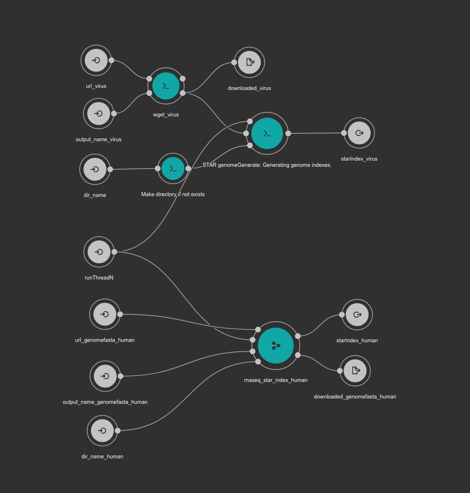
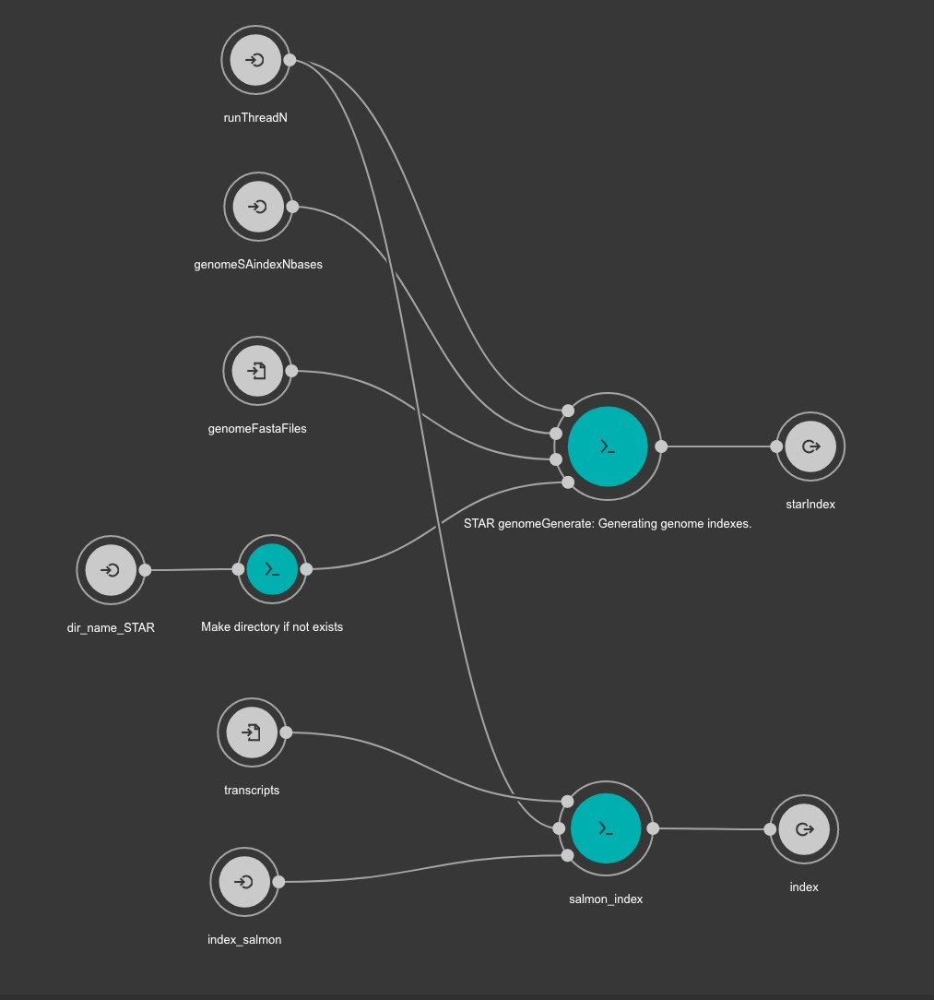

# VirTect_cwl

Re-implementation and upadate of [VirTect](https://github.com/WGLab/VirTect) by cwl. Base cwl tools are mainly from [DAT2-cwl](https://github.com/pitagora-network/DAT2-cwl/tree/develop).

## dependencies

- cwltool `conda install -c bioconda cwltool`
- docker

## createindex.cwl

`VirTect_cwl/workflow`

```
cwltool createindex.cwl -h
usage: ../workflow/createindex.cwl [-h] --url_virus URL_VIRUS
                                   --output_name_virus OUTPUT_NAME_VIRUS
                                   [--runThreadN RUNTHREADN]
                                   --dir_name_STAR_virus DIR_NAME_STAR_VIRUS
                                   --url_genomefasta_human
                                   URL_GENOMEFASTA_HUMAN
                                   --output_name_genomefasta_human
                                   OUTPUT_NAME_GENOMEFASTA_HUMAN
                                   --dir_name_STAR_human DIR_NAME_STAR_HUMAN
                                   --salmon_index_human SALMON_INDEX_HUMAN
                                   --url_transcript_human URL_TRANSCRIPT_HUMAN
                                   --output_name_human_transcipt
                                   OUTPUT_NAME_HUMAN_TRANSCIPT
                                   [job_order]

positional arguments:
  job_order             Job input json file

optional arguments:
  -h, --help            show this help message and exit
  --url_virus URL_VIRUS
  --output_name_virus OUTPUT_NAME_VIRUS
  --runThreadN RUNTHREADN
  --dir_name_STAR_virus DIR_NAME_STAR_VIRUS
  --url_genomefasta_human URL_GENOMEFASTA_HUMAN
  --output_name_genomefasta_human OUTPUT_NAME_GENOMEFASTA_HUMAN
  --dir_name_STAR_human DIR_NAME_STAR_HUMAN
  --salmon_index_human SALMON_INDEX_HUMAN
  --url_transcript_human URL_TRANSCRIPT_HUMAN
  --output_name_human_transcipt OUTPUT_NAME_HUMAN_TRANSCIPT
```

```
cwltool createindex.cwl createindex.job.yaml
```

virus fasta is from [VirTect](https://github.com/WGLab/VirTect).



## createindex_singlevirus.cwl

`VirTect_cwl/workflow`

```
cwltool createindex_singlevirus.cwl -h
usage: ../workflow/createindex_singlevirus.cwl [-h] --dir_name_STAR
                                               DIR_NAME_STAR
                                               [--runThreadN RUNTHREADN]
                                               --genomeFastaFiles
                                               GENOMEFASTAFILES
                                               [--genomeSAindexNbases GENOMESAINDEXNBASES]
                                               --transcripts TRANSCRIPTS
                                               --index_salmon INDEX_SALMON
                                               [job_order]

positional arguments:
  job_order             Job input json file

optional arguments:
  -h, --help            show this help message and exit
  --dir_name_STAR DIR_NAME_STAR
  --runThreadN RUNTHREADN
  --genomeFastaFiles GENOMEFASTAFILES
  --genomeSAindexNbases GENOMESAINDEXNBASES
                        For small genome such as single virus, this value need
                        to be small.
  --transcripts TRANSCRIPTS
  --index_salmon INDEX_SALMON
```

example (EBV)

```
cwltool createindex_singlevirus.cwl createindex_singlevirus.job.yaml
```

We recommend you to download fasta files for viruses from [NCBI](https://www.ncbi.nlm.nih.gov/nuccore/NC_007605.1?report=fasta).



## test

```
cd test
bash prep_test.sh
```