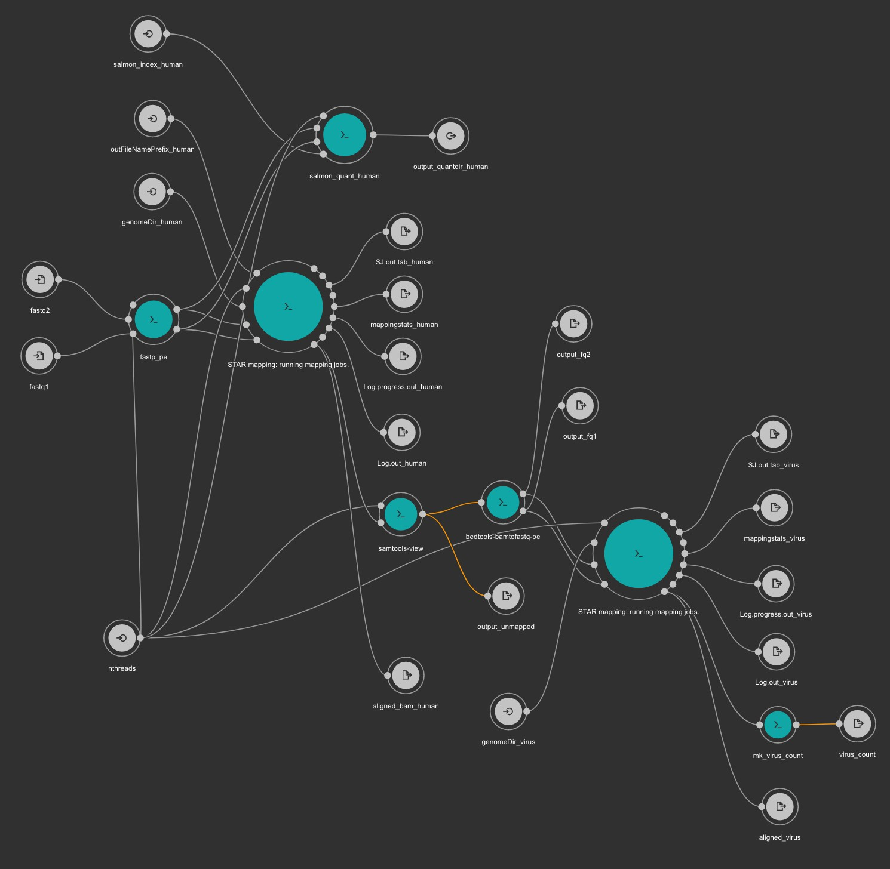
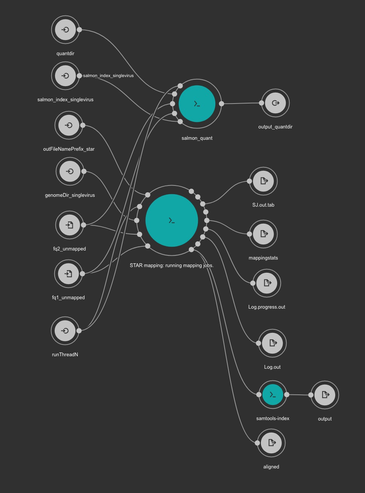

# VirTect_cwl

Re-implementation and upadate of [VirTect](https://github.com/WGLab/VirTect) by cwl.

## dependencies

- cwltool `conda install -c bioconda cwltool`
- docker

## createindex.cwl (execute only once)

`VirTect_cwl/workflow`

```
usage: createindex.cwl [-h] --url_virus URL_VIRUS
                                   --output_name_virus OUTPUT_NAME_VIRUS
                                   [--runThreadN RUNTHREADN]
                                   --dir_name_STAR_virus DIR_NAME_STAR_VIRUS
                                   --url_genomefasta_human URL_GENOMEFASTA_HUMAN
                                   --output_name_genomefasta_human OUTPUT_NAME_GENOMEFASTA_HUMAN
                                   --dir_name_STAR_human DIR_NAME_STAR_HUMAN
                                   --salmon_index_human SALMON_INDEX_HUMAN
                                   --url_transcript_human URL_TRANSCRIPT_HUMAN
                                   --output_name_human_transcipt OUTPUT_NAME_HUMAN_TRANSCIPT
                                   [job_order]

positional arguments:
  job_order             Job input json file

optional arguments:
  -h, --help            show this help message and exit
  --url_virus URL_VIRUS
  --output_name_virus OUTPUT_NAME_VIRUS
  --runThreadN RUNTHREADN
  --dir_name_STAR_virus DIR_NAME_STAR_VIRUS
  --url_genomefasta_human URL_GENOMEFASTA_HUMAN
  --output_name_genomefasta_human OUTPUT_NAME_GENOMEFASTA_HUMAN
  --dir_name_STAR_human DIR_NAME_STAR_HUMAN
  --salmon_index_human SALMON_INDEX_HUMAN
  --url_transcript_human URL_TRANSCRIPT_HUMAN
  --output_name_human_transcipt OUTPUT_NAME_HUMAN_TRANSCIPT
```

```
./createindex.cwl createindex.job.yaml
```

virus fasta is from [VirTect](https://github.com/WGLab/VirTect).


## createindex_singlevirus.cwl (execute only once)

`VirTect_cwl/workflow`

```
usage: createindex_singlevirus.cwl [-h] --dir_name_STAR DIR_NAME_STAR
                                               [--runThreadN RUNTHREADN]
                                               --genomeFastaFiles GENOMEFASTAFILES
                                               [--genomeSAindexNbases GENOMESAINDEXNBASES]
                                               --transcripts TRANSCRIPTS
                                               --index_salmon INDEX_SALMON
                                               [job_order]

positional arguments:
  job_order             Job input json file

optional arguments:
  -h, --help            show this help message and exit
  --dir_name_STAR DIR_NAME_STAR
  --runThreadN RUNTHREADN
  --genomeFastaFiles GENOMEFASTAFILES
  --genomeSAindexNbases GENOMESAINDEXNBASES
                        For small genome such as single virus, this value need
                        to be small.
  --transcripts TRANSCRIPTS
  --index_salmon INDEX_SALMON
```

example (EBV)

```
./createindex_singlevirus.cwl createindex_singlevirus.job.yaml
```

We recommend you to download fasta files for viruses from [NCBI](https://www.ncbi.nlm.nih.gov/nuccore/NC_007605.1?report=fasta).


## virtect_pe.cwl

`VirTect_cwl/workflow`

```
usage: ./virtect_pe.cwl [-h] --fastq2 FASTQ2 --fastq1 FASTQ1 
                        --genomeDir_human GENOMEDIR_HUMAN
                        [--outFileNamePrefix_human OUTFILENAMEPREFIX_HUMAN]
                        [--nthreads NTHREADS] 
                        --genomeDir_virus GENOMEDIR_VIRUS 
                        --salmon_index_human SALMON_INDEX_HUMAN
                        --salmon_quantdir_human SALMON_QUANTDIR_HUMAN
                        [job_order]

positional arguments:
  job_order             Job input json file

optional arguments:
  -h, --help            show this help message and exit
  --fastq2 FASTQ2
  --fastq1 FASTQ1
  --genomeDir_human GENOMEDIR_HUMAN
  --outFileNamePrefix_human OUTFILENAMEPREFIX_HUMAN
  --nthreads NTHREADS
  --genomeDir_virus GENOMEDIR_VIRUS
  --salmon_quantdir_human SALMON_QUANTDIR_HUMAN
  --salmon_index_human SALMON_INDEX_HUMAN

```

example1

```
./virtect_pe.cwl virtect_pe.job.yaml
```

example2

```
./virtect_pe.cwl \
--fastq1 ../test/ERR3240275_1.fastq.gz \
--fastq2 ../test/ERR3240275_2.fastq.gz \
--genomeDir_human ../test/STAR_index_human \
--genomeDir_virus ../test/STAR_index_virus \
--salmon_index_human ../test/salmon_index_human \
--salmon_quantdir_human salmon_human
--outFileNamePrefix_human human \
--nthreads 40
```



## virtect_pe_quant_singlevirus.cwl

`VirTect_cwl/workflow`

```
usage: ./virtect_pe_quant_singlevirus.cwl [-h] --fq2_unmapped FQ2_UNMAPPED
                                          --fq1_unmapped FQ1_UNMAPPED
                                          --genomeDir_singlevirus GENOMEDIR_SINGLEVIRUS
                                          --salmon_index_singlevirus SALMON_INDEX_SINGLEVIRUS 
                                          --quantdir QUANTDIR
                                          [--outFileNamePrefix_star OUTFILENAMEPREFIX_STAR]
                                          [--runThreadN RUNTHREADN]
                                          [job_order]

positional arguments:
  job_order             Job input json file

optional arguments:
  -h, --help            show this help message and exit
  --fq2_unmapped FQ2_UNMAPPED
  --fq1_unmapped FQ1_UNMAPPED
  --genomeDir_singlevirus GENOMEDIR_SINGLEVIRUS
  --salmon_index_singlevirus SALMON_INDEX_SINGLEVIRUS
  --quantdir QUANTDIR
  --outFileNamePrefix_star OUTFILENAMEPREFIX_STAR
  --runThreadN RUNTHREADN
```

example1

```
./virtect_pe_quant_singlevirus.cwl virtect_pe_quant_singlevirus.job.yaml
```

example2

```
./virtect_pe_quant_singlevirus.cw \
--fq1_unmapped ../test/unmapped_1.fq \
--fq2_unmapped ../test/unmapped_2.fq \
--genomeDir_singlevirus ../test/STAR_index_NC_007605.1 \
--salmon_index_singlevirus ../test/salmon_index_NC_007605.1 \
--outFileNamePrefix_star NC_007605.1 \
--quantdir salmon_NC_007605.1
--runThreadN 40
```



## test

```
cd test
bash prep_test.sh
```

## cwl sources

- [https://github.com/pitagora-network/DAT2-cwl](https://github.com/pitagora-network/DAT2-cwl/tree/develop) : most tools
- [https://github.com/roryk/salmon-cwl](https://github.com/roryk/salmon-cwl) : salmon
- [https://github.com/nigyta/bact_genome](https://github.com/nigyta/bact_genome) : fastp