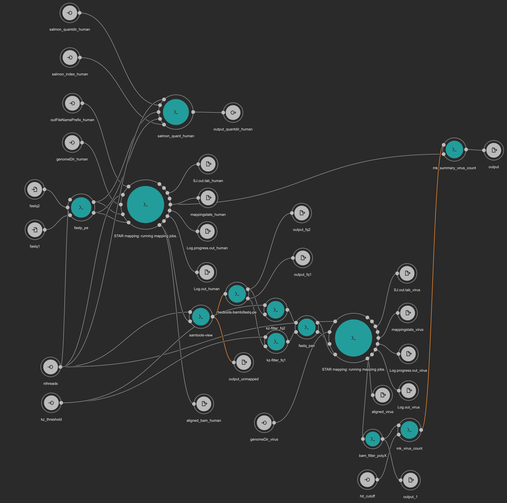

# VIRTUS : VIRal Transcript Usage Sensor v0.11 

## Note that this is an alpha release. Feel free to contact to Yoshiaki Yasumizu ([yyasumizu@ifrec.osaka-u.ac.jp](yyasumizu@ifrec.osaka-u.ac.jp)) before the usage.

Virus transcript detection and quantification using normal human RNAseq. VIRTUS is the first tool to detect viral transcripts considering their splicing event rather than the viral genome copy number. VIRTUS can be applied to both bulk RNAseq and single-cell RNAseq. The virus reference covers 763 viruses including COVID-19. The references are mainly from [VirTect](https://github.com/WGLab/VirTect). The workflow is implemented by [Common Workflow Language](https://www.commonwl.org/) and [Rabix](https://rabix.io/). You can specify each parameter individually or give `yaml` or `json` file which describes all the parameter information. In detail, check [the CWL User Guide](http://www.commonwl.org/user_guide/) out. 

## dependencies

- cwltool `conda install -c bioconda cwltool` 
- docker (alternatively, you can use udocker when you have no root privileges. See [Tips section](https://github.com/yyoshiaki/VIRTUS#tips).)

## Install

```
git clone https://github.com/yyoshiaki/VIRTUS
```

You can add `./VIRTUS/workflow` to `PATH` in `.zshrc` or `.bashrc` etc.

## createindex.cwl (execute only once)

`VIRTUS/workflow`

```
usage: createindex.cwl [-h] --url_virus URL_VIRUS
                                   --output_name_virus OUTPUT_NAME_VIRUS
                                   [--runThreadN RUNTHREADN]
                                   --dir_name_STAR_virus DIR_NAME_STAR_VIRUS
                                   --url_genomefasta_human URL_GENOMEFASTA_HUMAN
                                   --output_name_genomefasta_human OUTPUT_NAME_GENOMEFASTA_HUMAN
                                   --dir_name_STAR_human DIR_NAME_STAR_HUMAN
                                   --salmon_index_human SALMON_INDEX_HUMAN
                                   --url_transcript_human URL_TRANSCRIPT_HUMAN
                                   --output_name_human_transcipt OUTPUT_NAME_HUMAN_TRANSCIPT
                                   [job_order]

positional arguments:
  job_order             Job input json file

optional arguments:
  -h, --help            show this help message and exit
  --url_virus URL_VIRUS
  --output_name_virus OUTPUT_NAME_VIRUS
  --runThreadN RUNTHREADN
  --dir_name_STAR_virus DIR_NAME_STAR_VIRUS
  --url_genomefasta_human URL_GENOMEFASTA_HUMAN
  --output_name_genomefasta_human OUTPUT_NAME_GENOMEFASTA_HUMAN
  --dir_name_STAR_human DIR_NAME_STAR_HUMAN
  --salmon_index_human SALMON_INDEX_HUMAN
  --url_transcript_human URL_TRANSCRIPT_HUMAN
  --output_name_human_transcipt OUTPUT_NAME_HUMAN_TRANSCIPT
```

```
./createindex.cwl createindex.job.yaml
```

virus fasta is from [VirTect](https://github.com/WGLab/VirTect).

## createindex_singlevirus.cwl (execute only once)

`VIRTUS/workflow`

```
usage: createindex_singlevirus.cwl [-h] --dir_name_STAR DIR_NAME_STAR
                                               [--runThreadN RUNTHREADN]
                                               --genomeFastaFiles GENOMEFASTAFILES
                                               [--genomeSAindexNbases GENOMESAINDEXNBASES]
                                               --transcripts TRANSCRIPTS
                                               --index_salmon INDEX_SALMON
                                               [job_order]

positional arguments:
  job_order             Job input json file

optional arguments:
  -h, --help            show this help message and exit
  --dir_name_STAR DIR_NAME_STAR
  --runThreadN RUNTHREADN
  --genomeFastaFiles GENOMEFASTAFILES
  --genomeSAindexNbases GENOMESAINDEXNBASES
                        For small genome such as single virus, this value need
                        to be small.
  --transcripts TRANSCRIPTS
  --index_salmon INDEX_SALMON
```

example (EBV)

```
./createindex_singlevirus.cwl createindex_singlevirus.job.yaml
```

We recommend you to download fasta files for viruses from [NCBI](https://www.ncbi.nlm.nih.gov/nuccore/NC_007605.1?report=fasta).

## VIRTUS.PE.cwl

`VIRTUS/workflow`

```
usage: ./VIRTUS.PE.cwl [-h] --fastq2 FASTQ2 --fastq1 FASTQ1 
                        --genomeDir_human GENOMEDIR_HUMAN
                        [--outFileNamePrefix_human OUTFILENAMEPREFIX_HUMAN]
                        [--nthreads NTHREADS] 
                        --genomeDir_virus GENOMEDIR_VIRUS 
                        --salmon_index_human SALMON_INDEX_HUMAN
                        --salmon_quantdir_human SALMON_QUANTDIR_HUMAN
                        [--hit_cutoff HIT_CUTOFF]
                        [job_order]

positional arguments:
  job_order             Job input json file

optional arguments:
  -h, --help            show this help message and exit
  --fastq2 FASTQ2
  --fastq1 FASTQ1
  --genomeDir_human GENOMEDIR_HUMAN
  --outFileNamePrefix_human OUTFILENAMEPREFIX_HUMAN
  --nthreads NTHREADS
  --genomeDir_virus GENOMEDIR_VIRUS
  --salmon_quantdir_human SALMON_QUANTDIR_HUMAN
  --salmon_index_human SALMON_INDEX_HUMAN
  --hit_cutoff HIT_CUTOFF
```

example1

```
./VIRTUS.PE.cwl VIRTUS.PE.job.yaml
```

example2

```
./VIRTUS.PE.cwl \
--fastq1 ../test/ERR3240275/ERR3240275_1.fastq.gz \
--fastq2 ../test/ERR3240275/ERR3240275_2.fastq.gz \
--genomeDir_human ../test/STAR_index_human \
--genomeDir_virus ../test/STAR_index_virus \
--salmon_index_human ../test/salmon_index_human \
--salmon_quantdir_human salmon_human \
--outFileNamePrefix_human human \
--nthreads 40
```

### Output

`virus.counts.final.tsv` is the main output. The default threashold of the hit reads for each virus is set to 400 empirically. The example of `virus.counts.final.tsv` is like below.

|virus|hit reads|ratio hit reads / read mapped on human genome|
|--|--|--|
|NC_007605.1_Human_herpesvirus_4_complete_wild_type_genome|9813|0.00132130136267871|
|NC_009334.1_Human_herpesvirus_4,_complete_genome|2025|0.0002726623111611523|
|NC_001716.2_Human_herpesvirus_7,_complete_genome|412|5.5474998616491234e-05|

`salmon_human` directory contains the output from salmon. You can manipurate the results using `tximport` or `tximeta` which are cool R libraries.



## VIRTUS.SE.cwl

`VIRTUS/workflow`

```
usage: ./VIRTUS.SE.cwl [-h] --fastq FASTQ 
                        --genomeDir_human GENOMEDIR_HUMAN
                        [--outFileNamePrefix_human OUTFILENAMEPREFIX_HUMAN]
                        [--nthreads NTHREADS] 
                        --genomeDir_virus GENOMEDIR_VIRUS 
                        --salmon_index_human SALMON_INDEX_HUMAN
                        --salmon_quantdir_human SALMON_QUANTDIR_HUMAN
                        [--hit_cutoff HIT_CUTOFF]
                        [job_order]

positional arguments:
  job_order             Job input json file

optional arguments:
  -h, --help            show this help message and exit
  --fastq FASTQ
  --genomeDir_human GENOMEDIR_HUMAN
  --outFileNamePrefix_human OUTFILENAMEPREFIX_HUMAN
  --nthreads NTHREADS
  --genomeDir_virus GENOMEDIR_VIRUS
  --salmon_quantdir_human SALMON_QUANTDIR_HUMAN
  --salmon_index_human SALMON_INDEX_HUMAN
  --hit_cutoff HIT_CUTOFF
```

example1

```
./VIRTUS.SE.cwl VIRTUS.SE.job.yaml
```

example2

```
./VIRTUS.SE.cwl \
--fastq ../test/SRR8315715_2.fastq.gz \
--genomeDir_human ../test/STAR_index_human \
--genomeDir_virus ../test/STAR_index_virus \
--salmon_index_human ../test/salmon_index_human \
--salmon_quantdir_human salmon_human \
--outFileNamePrefix_human human \
--nthreads 40
```

## VIRTUS.PE.singlevirus.cwl

`VIRTUS/workflow`

```
usage: ./VIRTUS.PE.singlevirus.cwl [-h] --fq2_unmapped FQ2_UNMAPPED
                                        --fq1_unmapped FQ1_UNMAPPED
                                        --genomeDir_singlevirus GENOMEDIR_SINGLEVIRUS
                                        --salmon_index_singlevirus SALMON_INDEX_SINGLEVIRUS 
                                        --quantdir QUANTDIR
                                        [--outFileNamePrefix_star OUTFILENAMEPREFIX_STAR]
                                        [--runThreadN RUNTHREADN]
                                        [job_order]

positional arguments:
  job_order             Job input json file

optional arguments:
  -h, --help            show this help message and exit
  --fq2_unmapped FQ2_UNMAPPED
  --fq1_unmapped FQ1_UNMAPPED
  --genomeDir_singlevirus GENOMEDIR_SINGLEVIRUS
  --salmon_index_singlevirus SALMON_INDEX_SINGLEVIRUS
  --quantdir QUANTDIR
  --outFileNamePrefix_star OUTFILENAMEPREFIX_STAR
  --runThreadN RUNTHREADN
```

example1

```
./VIRTUS.PE.singlevirus.cwl VIRTUS.PE.singlevirus.job.yaml
```

example2

```
./VIRTUS.PE.singlevirus.cwl \
--fq1_unmapped ../test/ERR3240275/unmapped_1.fq \
--fq2_unmapped ../test/ERR3240275/unmapped_2.fq \
--genomeDir_singlevirus ../test/STAR_index_NC_007605.1 \
--salmon_index_singlevirus ../test/salmon_index_NC_007605.1 \
--outFileNamePrefix_star NC_007605.1 \
--quantdir salmon_NC_007605.1 \
--runThreadN 40
```

`--quantdir` directory contains the output from salmon. You can manipurate the results using `tximport` or `tximeta` which are cool R libraries as well.


## VIRTUS.SE.singlevirus.cwl

`VIRTUS/workflow`

```
usage: ./VIRTUS.SE.singlevirus.cwl [-h] --fq_unmapped FQ_UNMAPPED
                                        --genomeDir_singlevirus GENOMEDIR_SINGLEVIRUS
                                        --salmon_index_singlevirus SALMON_INDEX_SINGLEVIRUS 
                                        --quantdir QUANTDIR
                                        [--outFileNamePrefix_star OUTFILENAMEPREFIX_STAR]
                                        [--runThreadN RUNTHREADN]
                                        [--hit_cutoff HIT_CUTOFF]
                                        [job_order]

positional arguments:
  job_order             Job input json file

optional arguments:
  -h, --help            show this help message and exit
  --fq_unmapped FQ_UNMAPPED
  --genomeDir_singlevirus GENOMEDIR_SINGLEVIRUS
  --salmon_index_singlevirus SALMON_INDEX_SINGLEVIRUS
  --quantdir QUANTDIR
  --outFileNamePrefix_star OUTFILENAMEPREFIX_STAR
  --runThreadN RUNTHREADN
```

example1

```
./VIRTUS.SE.singlevirus.cwl VIRTUS.SE.singlevirus.job.yaml
```

example2

```
./VIRTUS.SE.singlevirus.cwl \
--fq_unmapped ../test/SRR8315715/unmapped.fq \
--genomeDir_singlevirus ../test/STAR_index_NC_001806.2 \
--salmon_index_singlevirus ../test/salmon_index_NC_001806.2 \
--outFileNamePrefix_star NC_001806.2 \
--quantdir salmon_NC_001806.2 \
--runThreadN 40
```

## mk_virus_tx2gene

Create the file `tx2gene.txt` to map transcripts to each gene for tximport.

```
% python mk_virus_tx2gene.py -h
usage: mk_virus_tx2gene.py [-h] input output

create tx2gene from an NCBI virus transcript fasta file.

positional arguments:
  input       input fasta file
  output      output file

optional arguments:
  -h, --help  show this help message and exit
```

example

```
python ./tool/mk_virus_tx2gene/mk_virus_tx2gene.py ./data/NC_007605.1.transcripts.fasta ./data/NC_007605.1.tx2gene.txt
```

## virus detection for 10x or Dropseq

10x and Dropseq use paired end sequence. The second fastq file contains only transcript's sequences. We recommend you to first run `VIRTUS.SE.cwl` for the second reads, then run alevin for detected virus. `createindex_singlevirus.cwl` can be used for building the index for [Alevin](https://salmon.readthedocs.io/en/latest/alevin.html). For example, the Dropseq's output from SRR8315715 can be screened like the command below.

```
./VIRTUS.SE.cwl \
--fastq ../test/SRR8315715_2.fastq.gz \
--genomeDir_human ../test/STAR_index_human \
--genomeDir_virus ../test/STAR_index_virus \
--salmon_index_human ../test/salmon_index_human \
--salmon_quantdir_human salmon_human \
--outFileNamePrefix_human human \
--nthreads 40
```

## virus detection for SmartSeq2

Just use `VIRTUS.PE.cwl` on each cell individually. When the number of reads is insufficient, VIRTUS may not detect viruses. The default threashold of the hit reads is 400. You can adjust the value in `tool/mk_virus_count.cwl`.

## tips

- cwltool may occupy all the system disk by tmp directory. If you suspect the situation, check `/tmp` or avoid by cwltool's option. The example is below. You can also delete the dir by `--rm-tmpdir`.

```
cwltool --tmp-outdir-prefix=/home/yyasumizu/tmp_cwl/ \
--tmpdir-prefix=/home/yyasumizu/tmp_cwl/ \
~/yyoshiaki-git/VIRTUS/workflow/VIRTUS.PE.cwl \
--fastq1 /home/yyasumizu/NGS_public/PRJEB31829_Blimph_EB/donor1_day0_1.fastq.gz \
--fastq2 /home/yyasumizu/NGS_public/PRJEB31829_Blimph_EB/donor1_day0_2.fastq.gz \
--genomeDir_human /home/yyasumizu/yyoshiaki-git/VIRTUS/test/STAR_index_human \
--genomeDir_virus /home/yyasumizu/yyoshiaki-git/VIRTUS/test/STAR_index_virus \
--salmon_index_human /home/yyasumizu/yyoshiaki-git/VIRTUS/test/salmon_index_human \
--salmon_quantdir_human donor1_day0/salmon_human \
--outFileNamePrefix_human /home/yyasumizu/EB_VIRTUS/donor1_day0/human --nthreads 20
```

- when you specify .cwl files in the absolute path, error may occur. use the relative path.
- note that you cannnot use `\`in --outFileNamePrefix_*
- STAR will require memory at least 30GB. Check your resources.
- You can use udocker instead of docker by cwltool option `--user-space-docker-cmd=udocker`.
- You can specify another host's reference URL such as the mouse in createindex steps, but note that virus references are designed for human viruses. We don't guarantee the result when you changed the reference species.  
- When you feel the sequence depth may be insufficient, see `virusAligned.filtered.sortedByCoord.out.bam` which conteins mapped reads assigned to viruses. Users can adjust the cutoff by `--hit_cutoff`

## test

After you clone this repo, try the test run first.

```
cd test
bash test.sh
```

## cwl sources

- [https://github.com/pitagora-network/DAT2-cwl](https://github.com/pitagora-network/DAT2-cwl/tree/develop) : most tools
- [https://github.com/roryk/salmon-cwl](https://github.com/roryk/salmon-cwl) : salmon
- [https://github.com/nigyta/bact_genome](https://github.com/nigyta/bact_genome) : fastp

## Contact

Yoshiaki Yasumizu ([yyasumizu@ifrec.osaka-u.ac.jp](yyasumizu@ifrec.osaka-u.ac.jp))

## Citation

Manuscript in preparation.

## Licence

This software is freely available for academic users. Usage for commercial purposes is not allowed. Please refer to the LICENCE page.

<a rel="license" href="http://creativecommons.org/licenses/by-nc/4.0/"></a>
